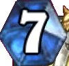
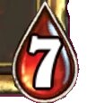
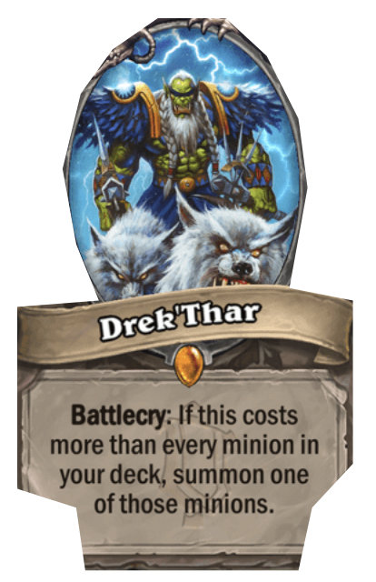

# Status Update

7/2/2022: This project will most likely be worked on from time to time. As of today's date, everything is up to date and functioning. However, the app will not work the next day because I don't know how to set up oauth, nor understand how to deal with that realm of APIs and have been relying on manually obtaining a new url. Any help would be greatly appreciated! 

# Topdeck Trump

Topdeck Trump is a minigame that compares a limited database of legendary hearthstone cards. The user plays a game versus "the computer." The main objective of the game is to correctly guess which card stat is better than the coomputer's card stat. 

# Background

Hearthstone is a card game made by Blizzard Entertainment.

A hearthstone card will consist of 3 main values: Mana Cost, Attack, and Health. 

Mana Cost represents how much mana is required to play that card. The Mana Cost of a card can be found on the top left of the card. 

 

Attack represents how much attack power a card has, while Health represents how much health points a card has. If two cards battle, they both do damange to each other. If the attack value exeeds the health value, then the card is destroyed. It is very much possible that when two cards battle, both cards can be destroyed. The attack value can be found on the botton right corner as a sword symbol, while the health value can be found on the bottom right as a blood drop background.

Most cards also have en effect that can be seen in the box below the portrait. Generally cards that have a multi round effect will tend to have a higher Mana Cost. This is also the same for cards that have higher Attack and Health values. 

Frequent hearthstone players should be able to use in game knowledge to make the correct guess. For others, they will have to use inductive reasoning based off of only two things: the image, and the effect. Good luck and have fun! 

